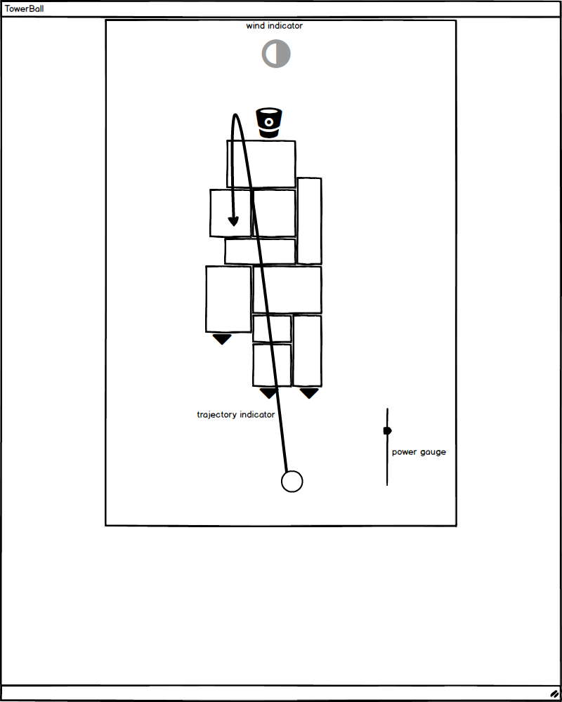

## TowerBall

### Background

A game simulating a 3-D physical experience using 2-D technology. The goal is to get the ball into the basket atop a tower of carefully balanced blocks. Blocks may be destroyed upon being hit, and you may lose the basket entirely! Fire carefully.

### Functionality & MVP  

With this TowerBall game, users will be able to:

- [x] See/change the trajectory of their ball via power slider
- [x] Fire the ball and destroy blocks
- [ ] Start a new game after it ends

### Wireframes

This app will consist of a single game screen that contains controls for power and an indicator of the trajectory affected by mouse movement

### Architecture and Technologies

This project will be implemented with the following technologies:

- Vanilla JavaScript for overall structure and game logic,
- `HTML5 Canvas` for rendering,
- Webpack to bundle and serve up the various scripts.
- mo.js for advanced animations (maybe)

In addition to the webpack entry file, there will be three scripts involved in this project:

`block.js`: this script will handle the logic for creating and simulating blocks affected by gravity

`ball.js`: this script will handle the logic of the ball's trajectory using vectors

`game.js`: this script with handle the logic of the game's procedures, environment setup and collisions

### Implementation Timeline

**Day 1**
- setup webpack
- outline classes
- review canvas
- be able to shoot ball using the spacebar
- have a goal

**Day 2**
- implement gravity on blocks
- implement random block generator

**Day 3**
- show trajectory of ball without wind affecting it
- implement wind and wind indicator

**Day 4**
- Add flourishes using mo.js
- Explore ways to make the game harder

### Future Updates
- [ ] Add wind and wind indicator
- [ ] Add health and AI opponent
- [ ] Switch out canvas shapes for sprites
- [ ] Add instructions