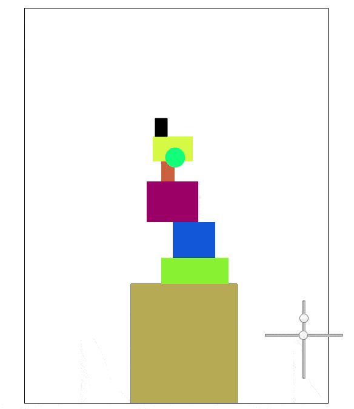

# TowerBall 

[TowerBall Live][git]

[git]: http://keithryanwong.github.io

TowerBall is a simple physics game where the player tries to hit a peg while avoiding letting it fall to the ground.

# Features & Implementation

## Vanilla Javascript

## Physics! Collisions!
Towerball has been implemented to simulate a 3-d physical experience in 2-d space. I did this by giving each object an [x, y] velocity vector which was updated per frame by a exponential variable that represents gravity.



## Object Oriented Programming (OOP)
I used 4 main classes to implement this game:
Game - handles gameplay logic and collision resolution
GameView - handles rendering of game and user state
User - handles interaction with the user via representation of visual elements on the screen and the keyboard
Destructable - represents each object in the game, giving them positional variables and the ability to interact with each other through virtual bounding boxes

## Random Tower Generation

Each time a new game starts, a tower of 5 blocks and 1 goalpast generates dynamically. The 5 blocks randomly vary in width and height, and will always spawn atop each other. There's a safety measure in place for when I choose to take into account each objects weight and center of gravity. It's tough to stack a tower that makes physical sense! So if it tries so many times and fails I have it stop before it burns out the processor. 

```javscript
generateBlocks(tower, mark) {
    let attempts = 0;

    while (tower.length < 6) {
      let lastMarkY = mark.y;
      let delta = Util.rand(30, 70);
      mark.y -= delta  ;

      let block = new Block(mark.x + Util.rand(0, mark.x), mark.y, Util.rand(20, 120), delta);
      tower.push(block);

      if(!Util.validPlacement(tower)) {
        mark.y = lastMarkY;
        tower.pop();
      }      
      attempts += 1;
      if (attempts > 1000) {
        break;
      } 
    }
  }
```

# Future Direction
- [ ] Add wind and wind indicator
- [ ] Add health and AI opponent
- [ ] Switch out canvas shapes for sprites
- [ ] Add instructions